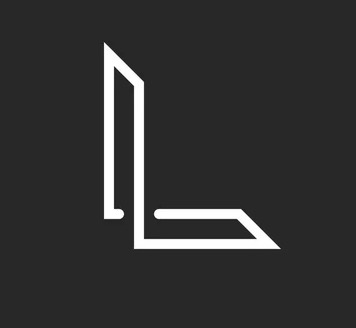

## 👋 Hello, I'm Lipika Aggarwal 

<!--
**LipikaAggarwal/LipikaAggarwal** is a ✨ _special_ ✨ repository because its `README.md` (this file) appears on your GitHub profile.

Here are some ideas to get you started:

- 🔭 I’m currently working on ...
- 🌱 I’m currently learning ...
- 👯 I’m looking to collaborate on ...
- 🤔 I’m looking for help with ...
- 💬 Ask me about ...
- 📫 How to reach me: ...
- 😄 Pronouns: ...
- ⚡ Fun fact: ...
-->

I’m a B.Tech student passionate about using technology to create solutions that make a positive impact. Skilled in developing projects with interactive and efficient designs, I enjoy working on practical applications and exploring the latest advancements in the tech world.

